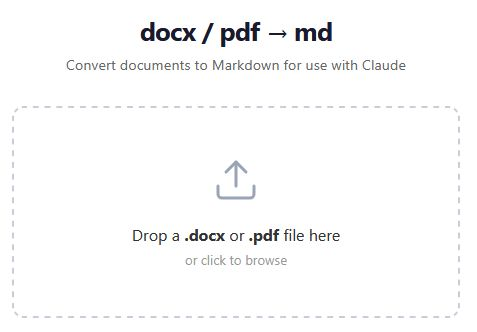

# Decant

## docx / pdf → md

A lightweight local utility that converts `.docx` and `.pdf` files to Markdown via a drag-and-drop web interface.

```
╔══════════╗
║ 10110100 ║
║ 01001011 ╠═~~>  # Heading
║ 11010110 ║       **bold**  _italic_  `code`
╚══════════╝       ─ list  ·  > blockquote
```



## Why

**To reduce token usage and processing time when using AI.**
AI chat and agent interfaces — Claude, ChatGPT, Copilot, etc. — work natively with text. Uploading a Word document or PDF requires the model to use tools, consume extra tokens, and spend time parsing a binary format before it can reason about the content. Markdown is plain text: the model reads it directly, with no overhead.

This tool sits in your local browser. Drop a file in, get a `.md` file back. The resulting Markdown can be pasted into a chat, attached as a text file, or fed to an agent — all with lower token cost and faster response times than the original binary.

You can set the container to autostart with Docker Desktop, open it in a browser tab. It's a handy utility to have as you work.

## Features

- Drag-and-drop (or click-to-browse) file selection
- Converts `.docx` and `.pdf` to Markdown
- Preserves headings, bold, italic, lists, and tables where possible
- Favors content integrity over formatting fidelity
- Warns if a PDF appears to contain only scanned images (no text layer)
- Download filename matches the original file, with an `.md` extension
- Runs entirely locally — no files leave your machine

## Prerequisites

- [Docker Desktop](https://www.docker.com/products/docker-desktop/) (Windows or Mac)

No other local dependencies are required to run the app.

## Getting started

**1. Clone the repository**

```bash
git clone https://github.com/your-username/docx_pdf_to_md.git
cd docx_pdf_to_md
```

**2. Build and start the container**

```bash
docker compose up --build
```

**3. Open the app**

Navigate to [http://localhost:8000](http://localhost:8000) in your browser.

**4. Stop the container**

```bash
docker compose down
```

## Changing the port

If port 8000 is already in use, set the `PORT` environment variable before starting:

```bash
PORT=8080 docker compose up --build
```

The app will be available at [http://localhost:8080](http://localhost:8080).

Alternatively, change the `PORT` value in the `.env` file before building and running `docker compose up --build`.

## Usage

1. Open the app in your browser
2. Drag a `.docx` or `.pdf` file onto the drop zone, or click the zone to browse for a file
3. Wait for conversion (a spinner appears during processing)
4. The converted `.md` file downloads automatically with the same base filename as the original
5. Drop another file at any time — the app is ready immediately after each conversion

**File size limit:** 100 MB per file. (Can be changed in `main.py` by changing `MAX_FILE_UPLOAD_SIZE_MB`)

**Unsupported files:** Any file that is not a `.docx` or `.pdf` is rejected with an error message. 

## Fully Local
No content is sent to a server — everything runs locally in Docker.

## Testing

If you want to modify this code, you can use the existing tests as a starting point. Unit and API tests run against the Python code directly and do not require Docker or a running server.

**Install dependencies**

```bash
pip install -r requirements.txt -r requirements-test.txt
```

**Run unit and API tests**

```bash
pytest tests/test_converter.py tests/test_api.py -v
```

**Browser integration tests**

Integration tests drive a real browser against the running app. They require Playwright and a running container.

Install Playwright:

```bash
pip install playwright
playwright install chromium
```

Start the app (if not already running):

```bash
docker compose up --build
```

Run the integration tests:

```bash
pytest tests/test_integration.py -v
```

> Integration tests are skipped automatically if Playwright is not installed or the app is not reachable at `localhost:8000`.

**Run all tests at once**

```bash
pytest -v
```

## Limitations

- Images embedded in `.docx` or `.pdf` files are not included in the Markdown output.
   - They don't provide additional value in most use cases, and handling the image file locations in markdown is additional scope that wasn't justifiable for me.
- Scanned PDFs (image-only, no text layer) produce empty or minimal output — a warning is shown
- **Not hardened for public deployment; intended for local, single-user use only**
